# Lab 1 - Administer and configure Dynamics 365 Contact Center

**Introduction :** This lab introduces the core administrative configuration tasks in **Dynamics 365 Contact Center**. Learners will explore the Copilot Service admin center, manage users and operational settings, enable generative AI and Copilot capabilities, configure agent experience settings, and create capacity profiles. By completing these exercises, learners will understand the foundational setup required to prepare a Contact Center environment for efficient agent operations and AI-powered customer service.

## Exercise 1 - Explore Channels in Copilot Service Admin Center - Explore Channels in Copilot Service Admin Center

In this exercise, learners sign in to the Contact Center environment and
navigate to the Copilot Service admin center to review the available
customer communication channels. They explore the channel management
interface and become familiar with the channels enabled for customer
interactions.

1.  Open a new private window. Use the URL that we extracted from the
    Power Platform admin center and log in to the Contact Center
    environment by using **Mark Brown's** credentials. Mark Brown is
    assigned the **System Administrator and Omnichannel Administrator
    roles.**

    > **Note:** If you have any confusion about the login. Revisit Exercise 4 of Lab 0.

    

2.  On the App selector, select **Copilot Service admin center** from
    the list of apps.

    

3.  Select **Channels** under **Customer Support** on the left
    navigation panel.

    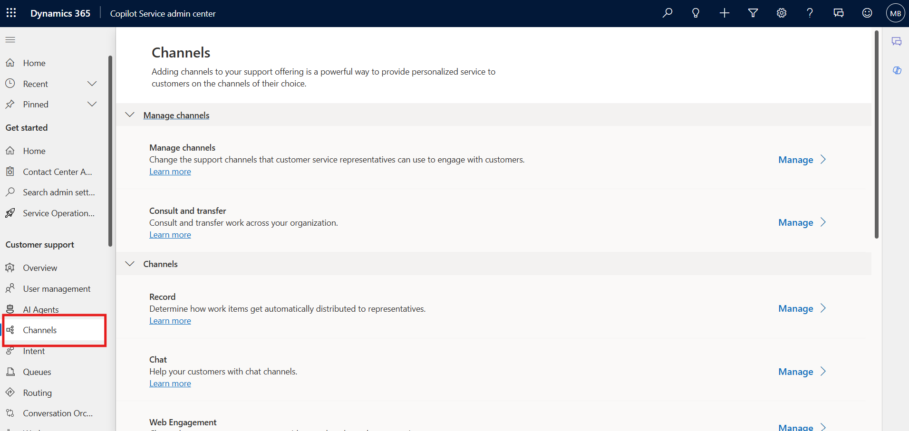

4.  Select **Manage** for **Manage channels**. The Manage Channels page
    appears.

    

5.  You can view the channels that are enabled.

## Exercise 2 – Manage users and update attributesattributes

In this exercise, learners explore enhanced user management by updating
user attributes such as skills, queues, and capacity profiles. They gain
an understanding of how these configurations influence work routing,
agent readiness, and workload distribution.

1.  Select **User management** under **Customer support** in the site
    map.

    

2.  On the page that appears, select **Manage** for **Enhanced user
    management**. The ‘**Contact center users’** view displays the users
    that have been configured in the Power Platform admin center.

    

3.  Hover the pointer over the rows of your **Mark Brown** users and
    select the check boxes.

    

4.  To update user attributes, select **Update user attributes**, and
    you will see three options available. You can select one of the
    options based on your requirements.

    

5.  **Update skills**: On the dialog box that appears, review and note
    the options available:

    1.  In the Skills field, select **Filter and Value**, then click on
        the **Add to all.**

        

    2.  **Add skills to users:** In the **Skills** box, select the skills
        that you want to add, select proficiency, and then select **Add to
        all**. The selected skill and proficiency are added to the users
        list. To have a different proficiency in the skills, select one
        skill at a time.

    3.  **Activate or deactivate**: Select a skill in the **Skills box and**
        select the ellipses to select **Activate for all** or **deactivate
        for all**. Users with a deactivated skill will not be considered
        during assignment if the skill requirement of a work item matches
        the deactivated skill.

    4.  **Remove skills**: To remove a skill from the list of users, select
        the skill in the **Skills** box, and select **Remove from all**.
        Save your changes. The selected skills are removed for the users.

        

6.  Click on **Save,** then **Close**.

7.  Again select **Mark Brown** radio button **\> Update user attributes
    \> Update queues**.

    1.  **Update queues**: Select all Default Queues and then click on the
        **Add to all.**

        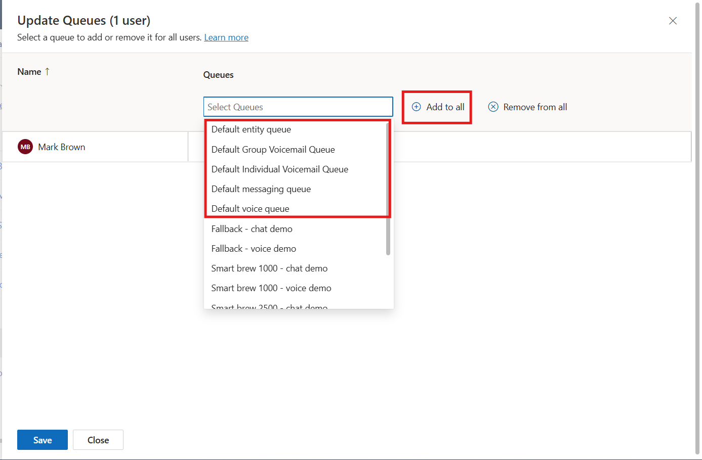

    2.  On the dialog box that appears, in the **Queues** box, review and
        note the options available.

10. Click on **Save,** then **Close**.

    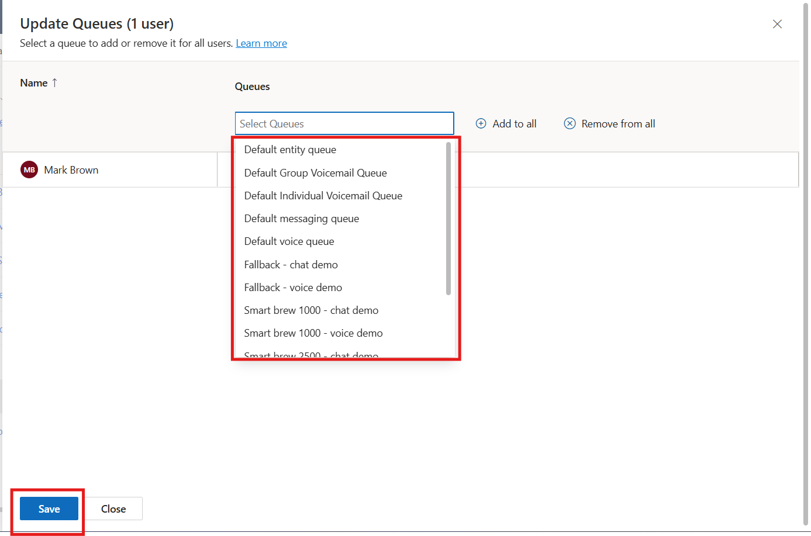

11. Now perform step 7 again and select **the Update capacity profile**.

12. On this dialog box, in the **Capacity profiles** box, select all
    profiles, review and note the options available, and then click on
    the **Add to all**.

    

13. Click on **Save and** then **Close.**

    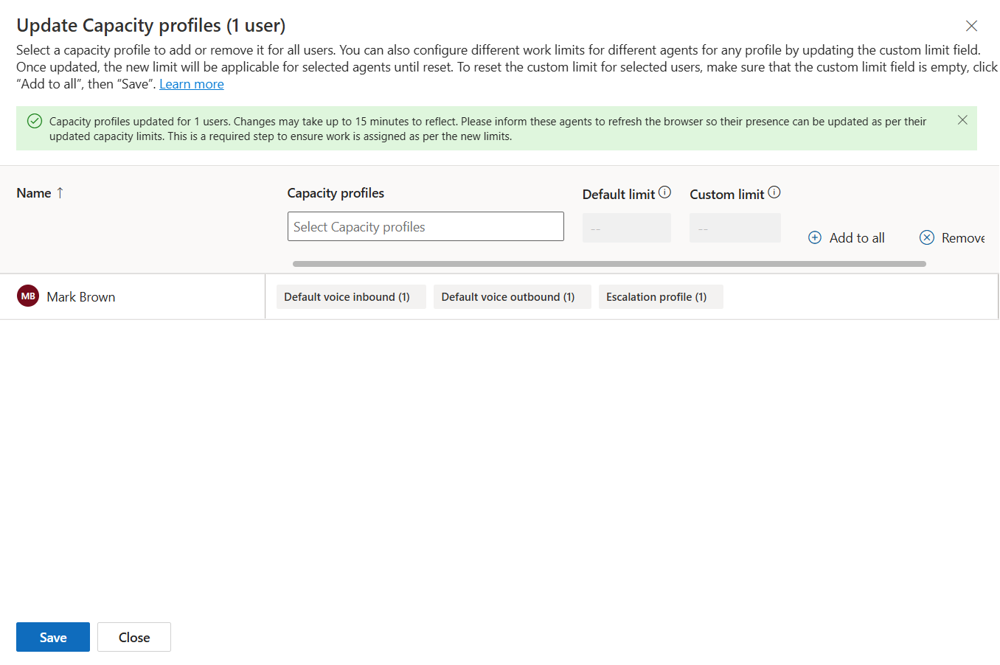

## Exercise 3 - Enable Generative AI features in the Power Platform Admin Center3 - Enable Generative AI features in the Power Platform Admin Center

In this exercise, learners access the Power Platform admin center to
review and enable generative AI settings for the Contact Center
environment. They verify the required AI configuration that supports
Copilot experiences and intelligent search capabilities.

1.  Open a new tab in the browser. Sign in to the Power Platform admin
    center - +++https://admin.powerplatform.microsoft.com/+++ With the
    **Mark Brown** credentials.

2.  From the left side panel, select the **Manage** option and then
    navigate to **Environments**.

    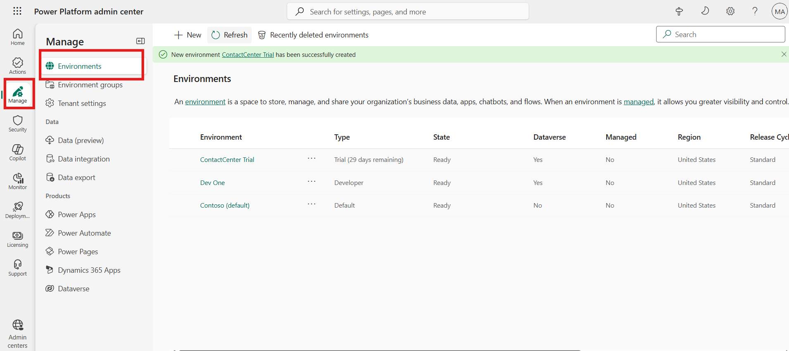

3.  Select your **Contact Center Trial** environment.

    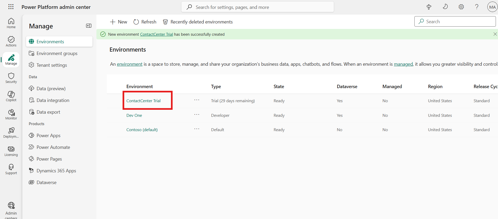

4.  On the Power Platform admin center page, scroll down until you see
    the **Generative AI features** card. Now, select **Edit**.

    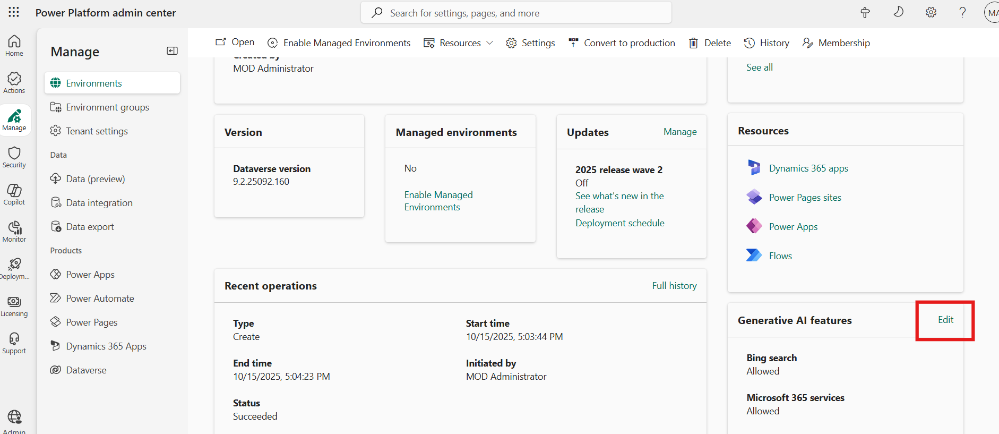

5.  Review the terms of use and select the **Bing Search** checkbox if
    it is not selected. When the **Bing Search** feature is turned on,
    your copilot in Microsoft Copilot Studio can use the data sources
    you provided, but it can use Bing’s APIs to index the results better
    and find the best answer from within your data sources.

6.  If any changes have been made, select **Save** to confirm them;
    otherwise, select **Cancel**.

    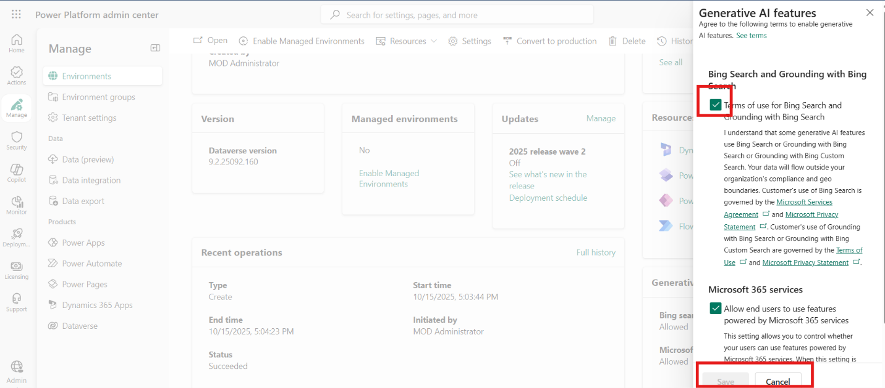

## Exercise 4 - Configure Copilot for questions and emailsemails

In this exercise, learners configure Copilot settings that enhance agent
productivity. They enable AI-powered capabilities such as response
translation, allowing agents to communicate more effectively with
customers across different languages.

1.  Switch back to the **Copilot Service admin center** tab.

2.  Select **Productivity** under **Support experience**.

3.  Select **Manage** for **Copilot settings**.

    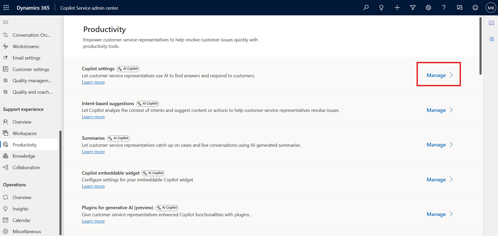

4.  Scroll down and select Let representative translate responses using
    copilot check box.

    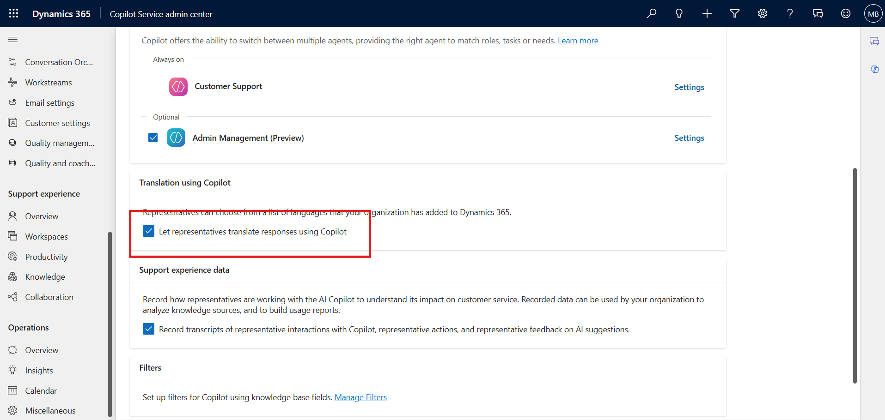

5.  Select **Save and close**.

    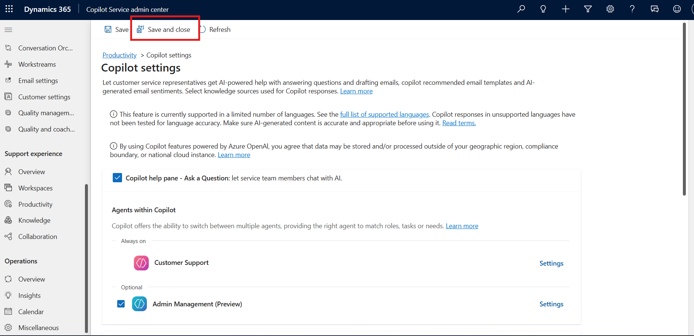

## Exercise 5 - Enable Copilot AI features in the agent Experience profiles

In this exercise, learners configure the agent experience profile by
enabling the Copilot help pane and AI-powered productivity features.
They ensure agents have access to intelligent assistance for generating
responses, answering questions, and composing emails during customer
interactions.

1.  On the left navigation pane, under **Support experience,** select
    **Workspaces.**

2.  Select **Manage** under **Experience profiles.**

    

3.  Select the **Customer Service Trial profile** agent experience
    profile from the list.

    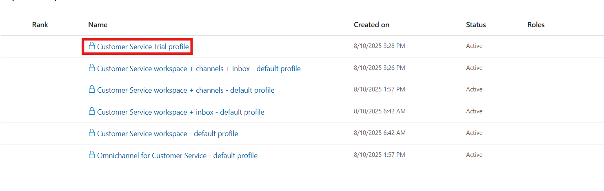

4.  On the **Productivity Pane**, make sure **Copilot help pane** toggle
    is **ON** so that agents can use the Copilot features such suggest a
    response, ask a question, and write an email on the productivity
    pane.

    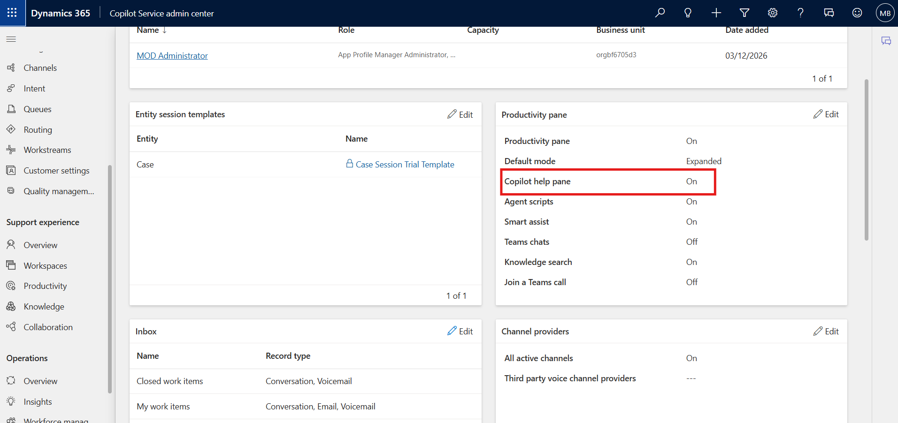

5.  Scroll down to **Copilot AI features** section. Make sure that all
    the Copilot AI features are enabled (except Intent-based suggestions
    (preview))

    

## Exercise 6: Create and assign a Capacity Profileassign a Capacity Profile

In this exercise, learners create a new capacity profile, configure
workload limits and assignment behavior, and assign the profile to a
user. This demonstrates how capacity management helps control agent
workloads and supports efficient work assignment.

1.  On the Copilot Service admin center, select **User
    management** under **Customer support**.

    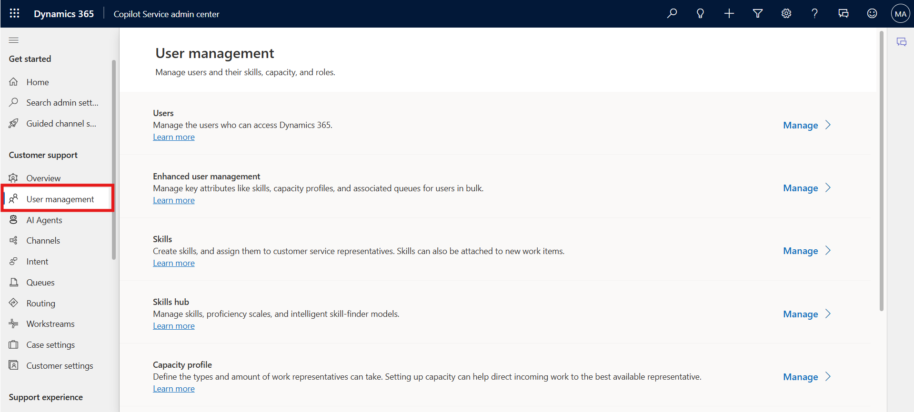

2.  Select the **Manage** option for **Capacity profile**.

    

3.  On the **Capacity profiles** page, select **Create new**.

    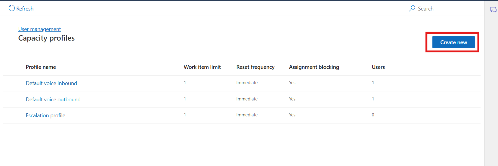

4.  On the **Details** tab of the **Create capacity profile** dialog
    box, enter the following details:

    - **Profile name**: Name for the capacity profile as +++Demo+++

    - **Work item limit**: Number of units of the work type that you can
      assign to the agent. – Enter - 5

    - **Reset frequency**: Period after which capacity consumption is
      reset for agents. Select **Immediate**

        > **Note** - Once configured, you must recreate the capacity profile
      if you want to change the reset frequency.

    - **Assignment blocking**: Set the toggle to **Yes**. When the work
      item limit is met, the agent isn’t assigned a new work item
      automatically.

        

5.  Select the capacity profile created. Select the **Users** Tab and
    Select **Add user**

    

6.  Select the **MOD Administrator** check box and then click on **Add
    user.**

    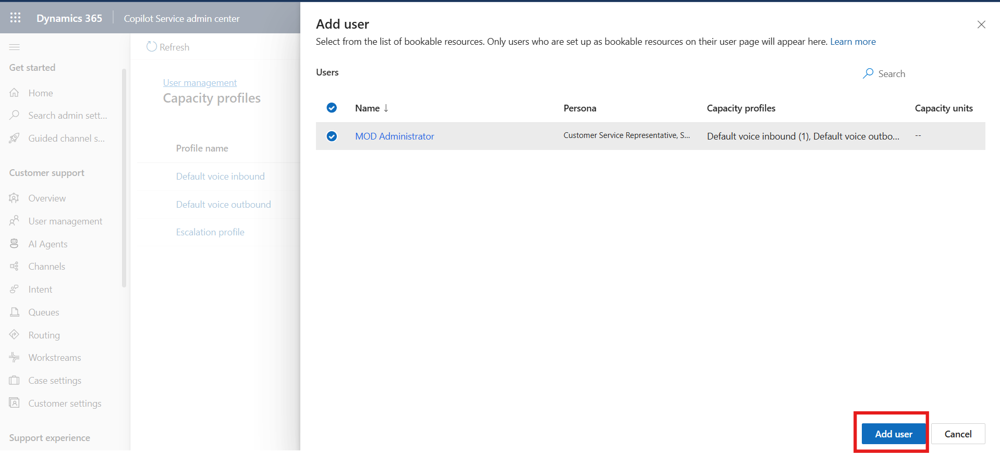

7.  Select **Save and Close.** The capacity profile is assigned to the
    admin user.

    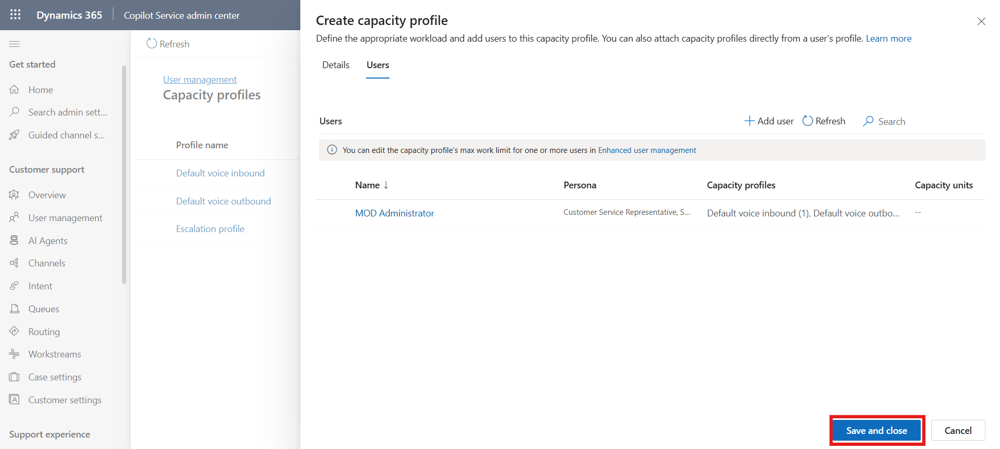

## Conclusion

In this lab, learners configured key administrative components of
**Dynamics 365 Contact Center**, including communication channels, user
attributes, AI and Copilot settings, agent experience profiles, and
capacity management. These configurations establish a well-prepared
Contact Center environment that supports intelligent routing, improved
agent productivity, and AI-powered customer service experiences.
