# Lab 11 - Configure quality, coaching, and AI-powered conversation orchestration in Dynamics 365 Contact Center

**Introduction :** In Dynamics 365 Contact Center, delivering consistent, high-quality
customer service depends on being able to measure representative
performance, coach in the moment, and route conversations intelligently.
This lab introduces the Quality and Coaching and Conversation
Orchestration capabilities in the Copilot Service admin center. You will
build the components that let AI evaluate conversations against defined
standards and take action on the results. Working as Mark Brown, you
will create a quality indicator and a guardrail in the Quality library,
assemble them into an evaluation plan with conditions and score-based
actions, and activate that plan so conversations are assessed
automatically. You will then explore Conversation Orchestration, browse
the Prompt gallery of scenario templates, and build a playbook that
dynamically escalates priority based on customer wait time—scoping it to
a channel and queues, and configuring its conditions and actions. By the
end, you will understand how quality evaluation and AI-powered
orchestration work together to improve both service outcomes and
representative development.

## Exercise 1: Open the Quality and Coaching area

1.  Open a new private (InPrivate/Incognito) browser window. Use the
    environment URL from Lab 0 and sign in with **Mark Brown's**
    credentials.

      > **Note:** If you have any confusion about the login, revisit Exercise 4 of Lab 0.

2.  On the App selector, select **Copilot Service admin center**.

    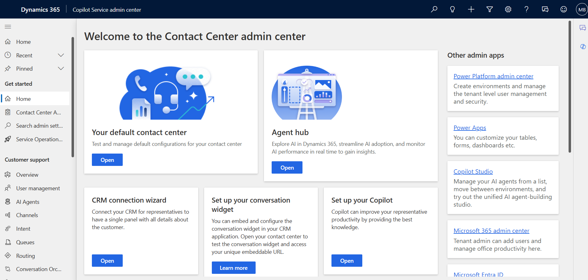

3.  In the left navigation, under **Customer support**, select **Quality
    and Coaching**.

    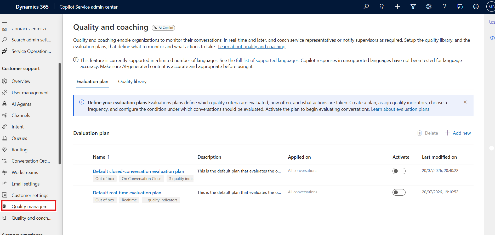

4.  Review the two tabs at the top of the page. You will use both in
    this lab:

    - **Evaluation plan** - create and manage evaluation plans that decide
      which conversations are evaluated and what actions follow.

        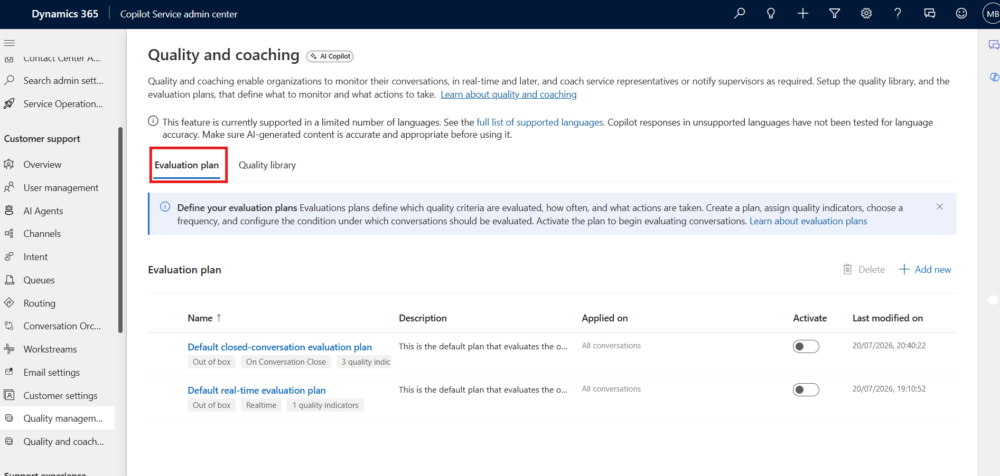

    - **Quality library** - manage the quality indicators and guardrails
      that define your evaluation criteria.

        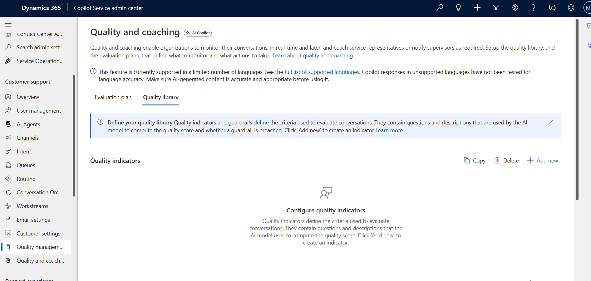

## Exercise 2: Create a quality indicator in the Quality library

1.  On the **Quality and Coaching** page, select the **Quality library**
    tab.

2.  Under **Quality indicators**, select **Add new**.

    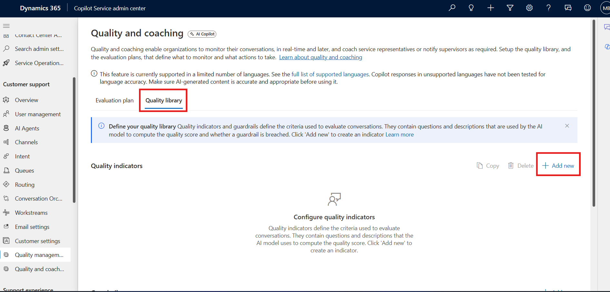

    > **Note:** To learn from an existing example, you can instead select a
    built-in indicator and copy it, then edit the copy. Built-in
    ndicators can be copied but not edited directly.

1.  On the **Add quality indicator** page, enter the following:

    - Quality indicator name: +++Greeting and empathy+++

    - Description: +++Measures whether the representative greeted the
      customer professionally and showed empathy.+++

2.  Under **Questions**, add the first question. Select **Add question**
    and enter:

    - Question text: +++Did the representative greet the customer politely
      and introduce themselves?+++

    - Type of answers: select **Yes/No**.

    - Assign scores to each answer option:

      - Yes = 10

      - No = 0

    > 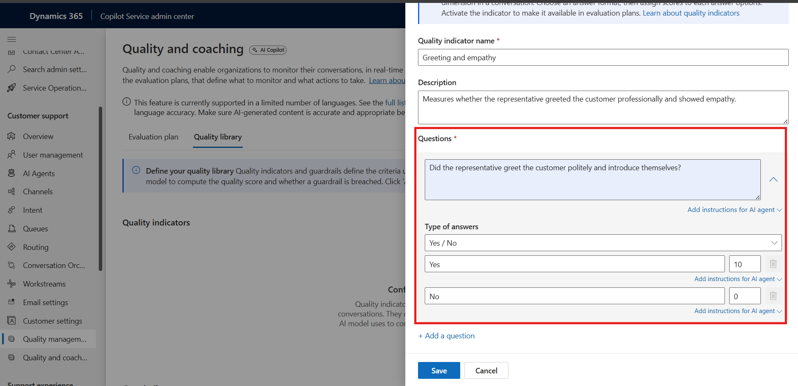

3.  Add a second question. Select **Add question** again and enter:

    - Question text: +++How well did the representative acknowledge the
      customer's concern?+++

    - Type of answers: select **Multiple choice**.

    - Add the answer options and assign scores:

      - Fully acknowledged and empathized = 10

      - Partially acknowledged = 5

      - Did not acknowledge = 0

    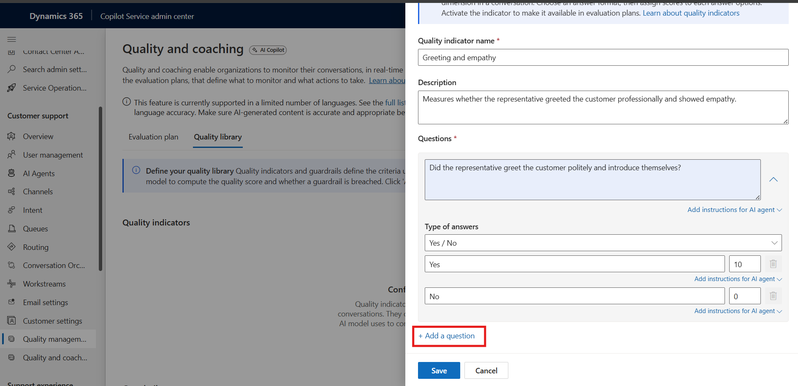

    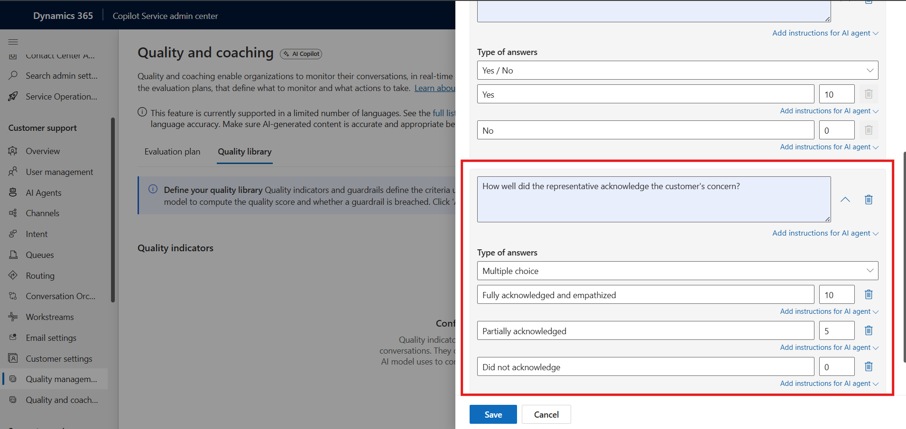

4.  Select **Save** to save the quality indicator.

    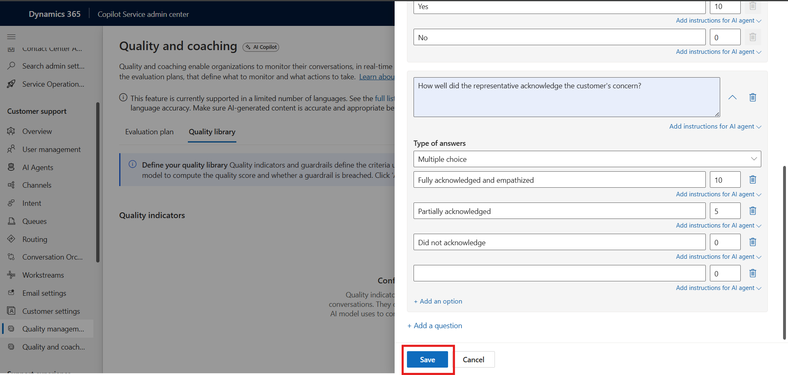

5.  Return to the **Quality and Coaching** page, locate the **Greeting
    and empathy** indicator, and **activate** it so it can be selected
    in an evaluation plan.

    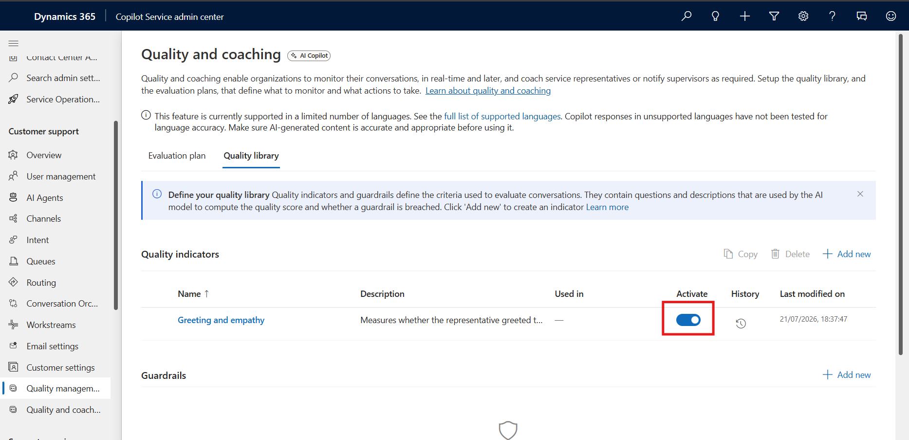

    > **Note:** Only active quality indicators appear in the
    quality-criteria list when you build an evaluation plan. You can
    delete inactive indicators you no longer need, but active ones must be
    deactivated first.

## Exercise 3: Create a guardrail in the Quality library

A guardrail defines an expected behavior and a priority. When the AI
detects a violation during a conversation, it can surface a coaching
nudge to the representative and, optionally, suggest a next response. In
this exercise, learners create a guardrail that prevents representatives
from making unauthorized commitments, then activate it.

1.  On the **Quality library** tab, under **Guardrails**, select **Add
    new**.

    > 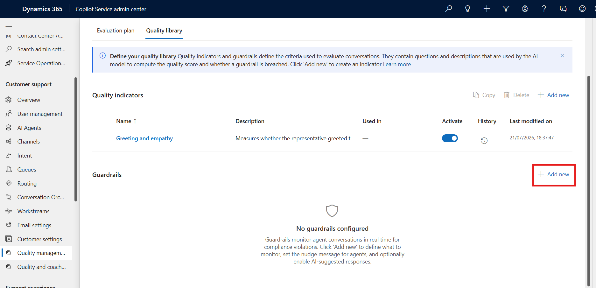

2.  On the **Add guardrail** page, enter the following:

    - Guardrail name: +++No unauthorized commitments+++

    - Description: +++Representatives must not promise refunds, discounts,
      or delivery dates that require supervisor approval.+++

    - Priority: select **High** to indicate urgency (options are Low,
      Medium, or High).

    - Nudge text: +++Avoid promising refunds or dates without approval.
      Offer to check and follow up.+++

    - Select **Suggest next response** to allow AI-generated guidance when a
      violation is detected.

3.  Select **Save** to save the guardrail.

    > 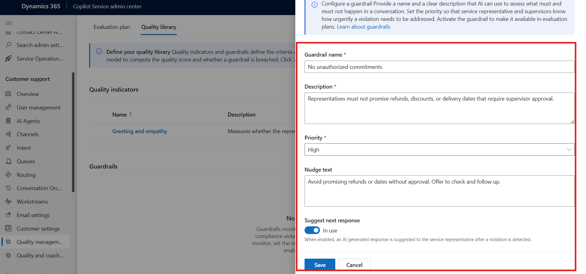

4.  Return to the **Quality and Coaching** page and **activate** the
    **No unauthorized commitments** guardrail so it can be selected in
    an evaluation plan.

    > 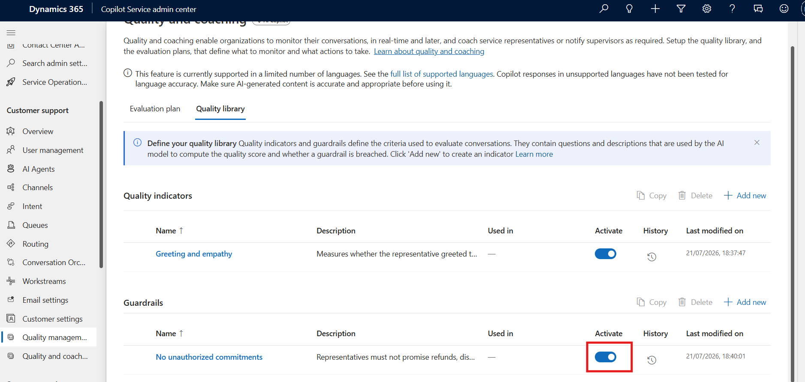

## Exercise 4: Create an evaluation plan

An evaluation plan brings together the quality criteria you built,
decides how often conversations are evaluated, filters which
conversations are in scope, and defines the actions that follow from the
scores. In this exercise, learners create a plan that uses the indicator
and guardrail from the previous exercises.

1.  On the **Quality and Coaching** page, select the **Evaluation plan**
    tab. This page lists all existing plans.

2.  Select **Add new**.

    > 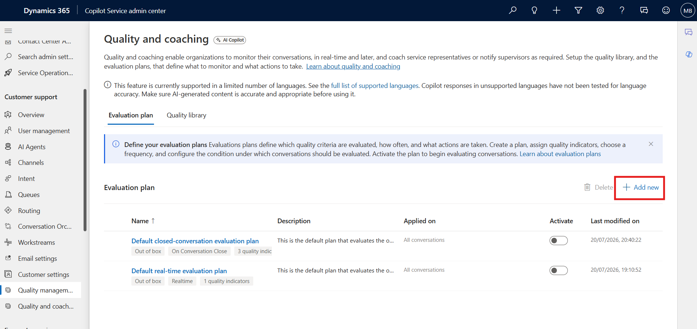

3.  On the **New evaluation plan** dialog, select the **Frequency**.
    Choose one of the following:

    - **In real-time** - evaluations run continuously throughout the
      conversation, with quality scores and guardrails assessed in real time
      to enable immediate action (coaching nudges appear live).

    - **On conversation close** - evaluations run once at the end of the
      conversation, with results available only after the conversation is
      closed.

4.  For this lab, select **On conversation close**, and then select
    **Next**.

    > 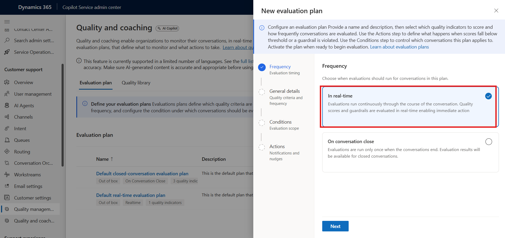

5.  In **General details**, provide the following, then select **Next**:

    - Plan name: +++Trial quality plan – messaging+++

    - Description: +++Evaluates greeting, empathy, and
      unauthorized-commitment guardrail on closed messaging conversations.

    - Quality criteria: select the **Greeting and empathy** indicator and
      the **No unauthorized commitments** guardrail you activated earlier.

    > 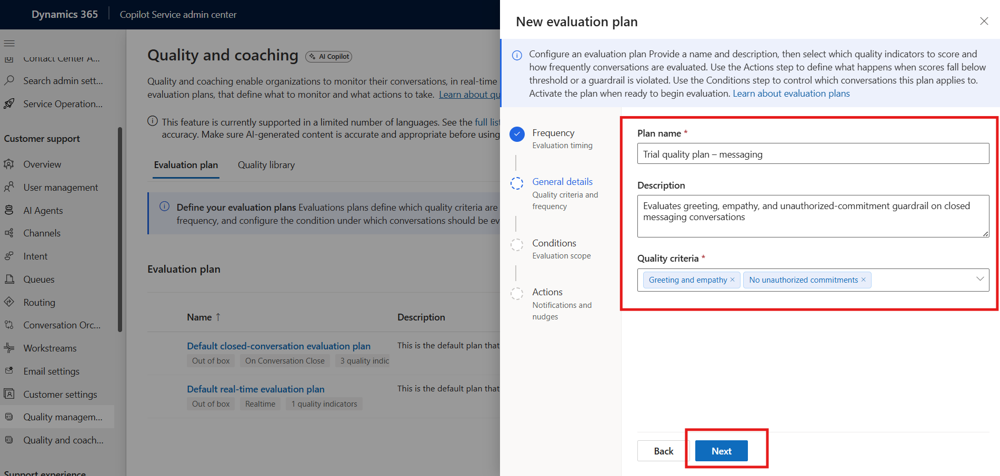

6.  In **Conditions**, add conditions to control which conversations the
    plan evaluates. Click Add and select Add row:

    - **Queue** equals default messaging queue.

    - **Workstream** equals Contoso chat workstream.

7.  Select **Next** to continue.

    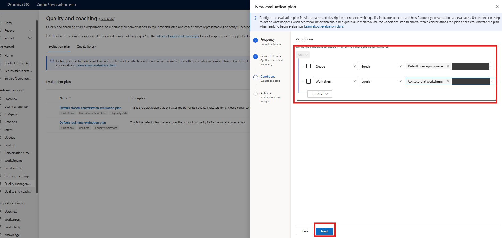

    > **Note:** If you leave conditions broad, the plan evaluates more
    conversations. Narrow conditions (a single queue or workstream) keep
    the trial focused and reduce consumption.

8.  In **Actions**, define score ranges and choose what happens for
    each. For the scored quality indicator, define the ranges as:

    > Set Greeting and empathy range as 100% For No authorized commitments, select **Notify supervisor and Send coaching nudge.**

9.  Select **Save** to save the evaluation plan.

    > 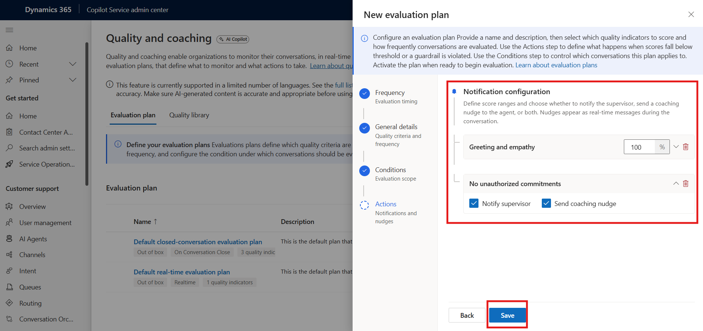

## Exercise 5: Activate the evaluation plan and verify the configuration

A saved plan does not evaluate conversations until it is activated. In
this exercise, learners activate the plan and confirm that every
component is in place.

1. On the **Quality and Coaching** page, locate the **Trial quality
    plan - messaging** plan.

11. Select the plan, and then select **Activate**. The status changes to
    indicate the plan is active and evaluations will begin.

    > 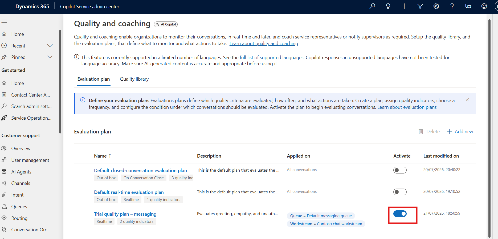

## Exercise 6: Open Conversation Orchestration and browse the Prompt gallery

In this exercise, learners open the Copilot Service admin center,
navigate to Conversation Orchestration, and explore the Prompt gallery
that provides templates for each scenario.

1.  With **Mark Brown's** session still open in the Copilot Service
    admin center, in the left navigation under **Customer support**,
    select **Conversation Orchestration (Preview)**.

    > 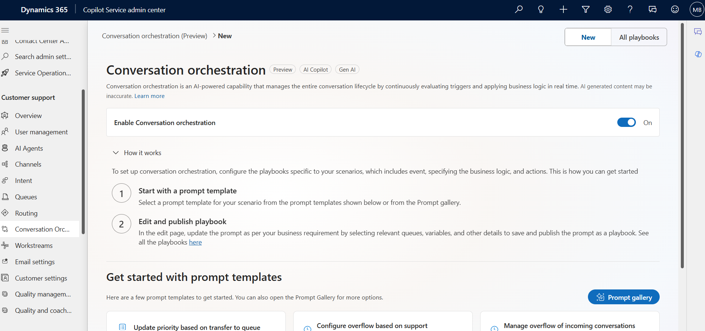

2.  Notice that the page displays three popular prompts by default. To
    view templates for all scenarios, select Prompt gallery. A pop-up
    window displays prompt templates for all scenarios.

    > 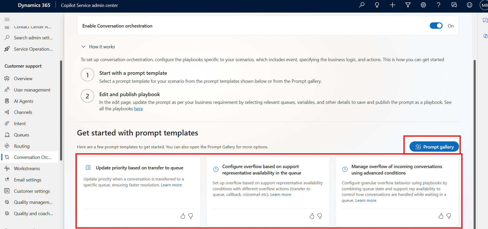

3.  In the drop-down field, browse the available categories and their
    templates:

- **Dynamic prioritization**:

  - **Escalate priority based on wait time** - for wait time-based
    dynamic or real-time prioritization.

  - **Escalate priority based on transfer to queue** - for
    transfer-based prioritization.

- **Overflow handling**:

  - **Configure overflow when queue goes out of operating hours** - for
    out-of-operating-hours overflow.

  - **Configure overflow when all users are logged out** - when all
    representatives in the queue are signed out.

  - **Configure overflow based on support representative availability in
    the queue** - for representative-availability overflow.

  - **Handle overflow for direct inward dialed call** - when a
    representative isn't available to take a direct inward dialed (DID)
    call.

- **Assign to a predicted expert**:

  - **Assign to a previous or preferred expert** - for a preferred
    expert, or an expert who previously interacted with the customer.

- **Bullseye routing with user groups**.

    > 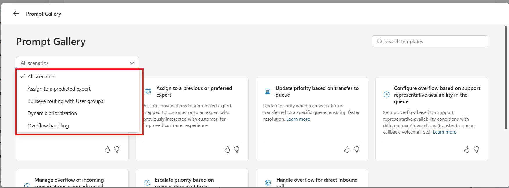

## Exercise 7: Create a playbook from a template and name it

In this exercise, learners select a scenario template and open the
playbook editor. This lab uses the wait time prioritization scenario as
a worked example; the same steps apply to any template.

1.  In the **Prompt gallery** drop-down, select the **Dynamic
    prioritization** category.

2.  Select the **Escalate priority based on wait time** template. The
    playbook editor opens.

    > 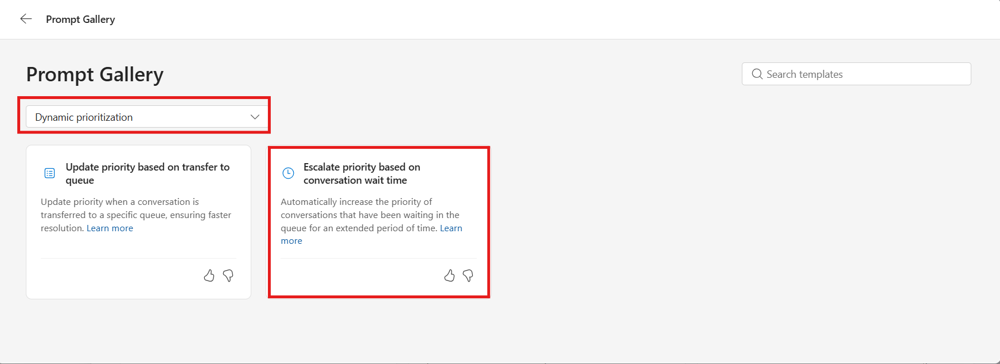

3.  In the **Playbook editor**, accept the default name or enter a
    descriptive name in **Playbook name**. For this lab, enter:

    - Playbook name: +++Gold tier wait-time escalation+++

    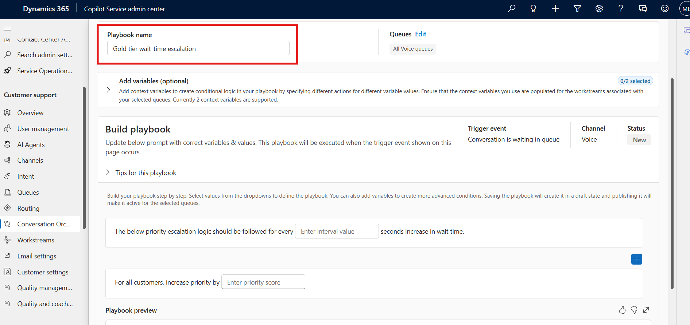

## Exercise 8: Scope the playbook to a channel and queues

In this exercise, learners define the channel and the queues the
playbook applies to. The channel choice also determines which context
variables are available later.

1.  In the playbook editor, select **Queues** \> **Edit** to open the
    queues pane.

    > 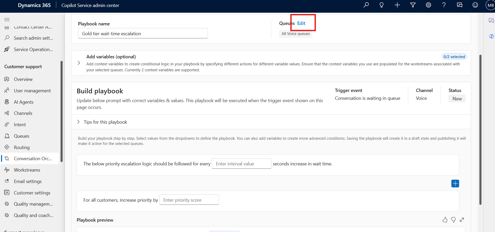

2.  For **Channel**, select **Voice** or **Messaging**. For this lab,
    select **Messaging**.

    > **Note:** The context variables that appear later are based on the
    > selected channel. If you change the channel in a draft playbook, you
    > must update the applicable context variables and the corresponding
    > prompt.

3.  In **Apply to**, select how to apply the playbook:

    - **All messaging queues** - applies to all queues for the selected
      channel.

    - **List of Messaging queues** - select specific queues from the list.

    - **All Messaging queues except** - applies to all queues except the
      ones you exclude.

4.  For this lab, select **List of Messaging queues** and choose default
    messaging queue.

5.  Select **Save** to save the queue scope.

    > 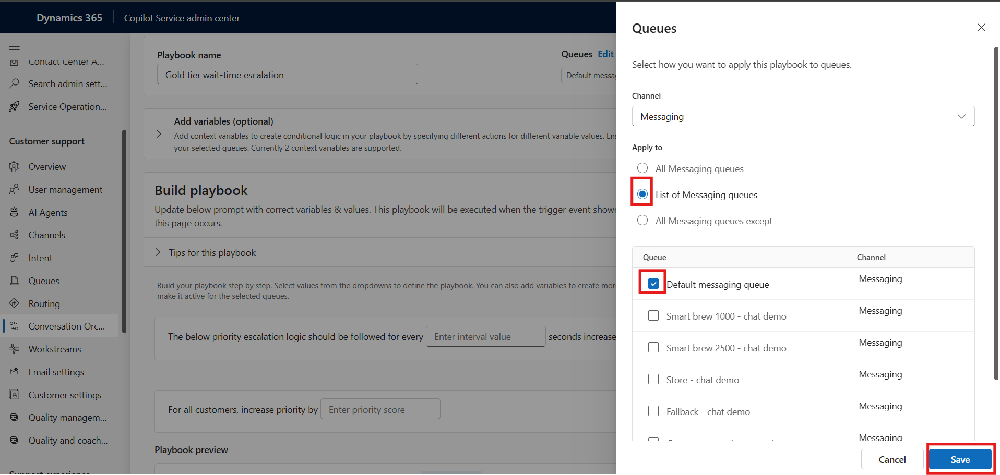

## Exercise 9: Configure conditions and actions

In this exercise, learners configure the business rules (conditions) and
the outcomes (actions) for the playbook, guided by the template. The
wait-time template escalates priority when a conversation waits beyond a
threshold.

1. On the edit playbook page, review the **Tips for this playbook**
    panel. It provides guidance to optimally configure the conditions
    for the selected template.

    > 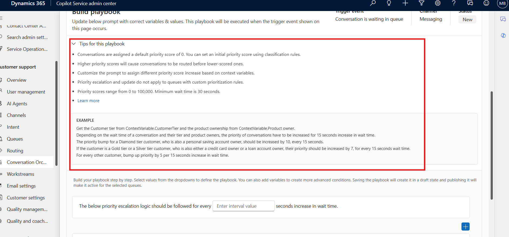

13. Configure the **conditions** based on the selected template. The
    below priority escalation logic set as 30 seconds.

    > 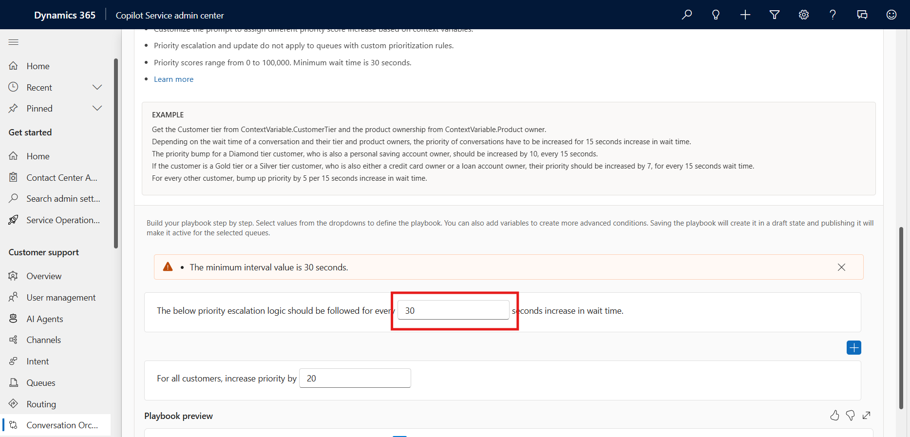

14. Configure the **actions** that run when the conditions are met. For
    all customers, increase priority to 20. Select **Save**. The
    playbook is saved as a **draft**.

    > 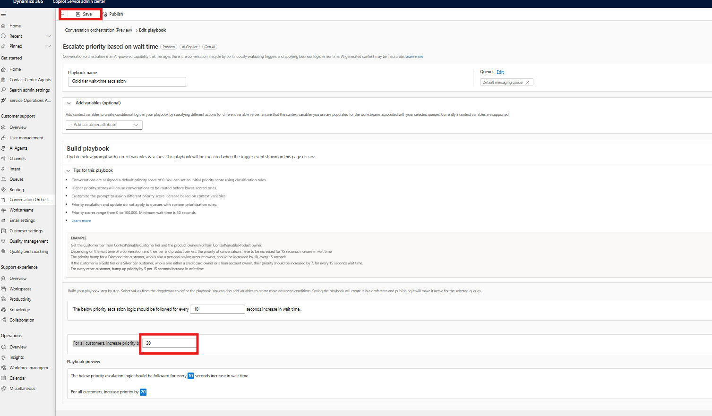

## Exercise 10: Edit and delete playbooks

In this exercise, learners edit an existing playbook and then learn how
to delete one. Editing behavior differs between draft and active
playbooks to protect live routing.

### Edit a playbook

1. Go to the **All playbooks** tab in **Conversation orchestration**.

16. Find the playbook you want to edit - for example, **Gold tier
    wait-time escalation**.

17. Select the **vertical ellipsis**, and then select **Edit**.

    > 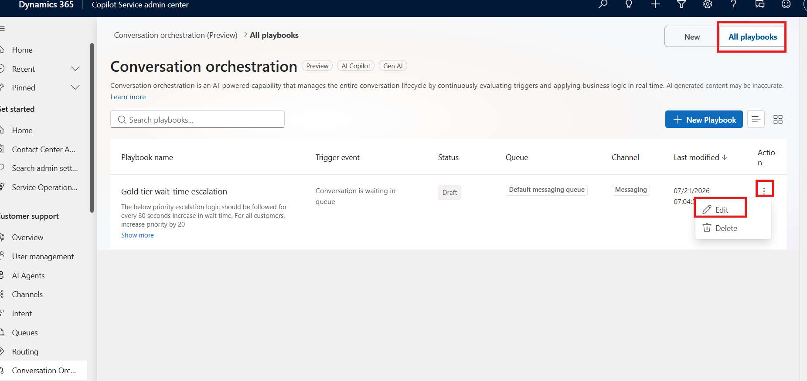

### Delete a playbook

4. Go to the **Playbook** tab.

19. Select the **actions menu (...)** for the playbook, and then select
    **Delete**.

    > 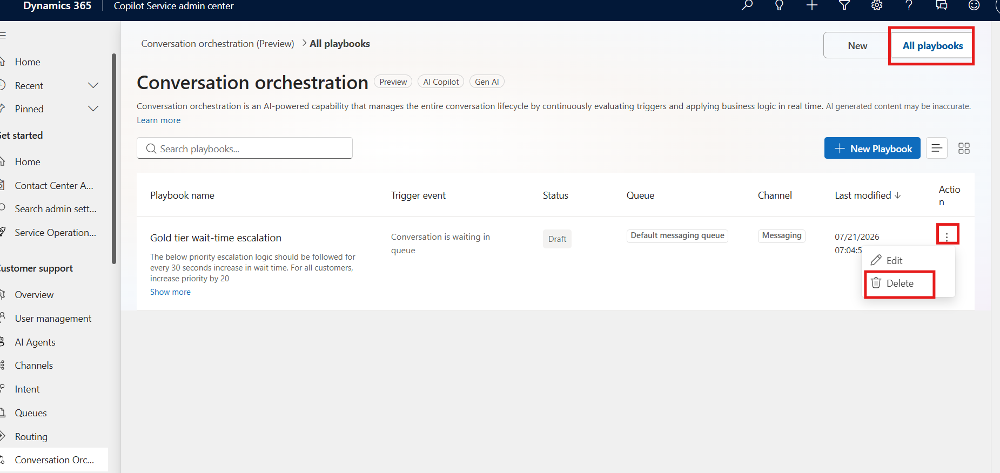

## Conclusion

In this lab, you configured an end-to-end quality, coaching, and
orchestration setup in Dynamics 365 Contact Center. You created and
activated a quality indicator and a guardrail, combined them into an
evaluation plan that runs on conversation close, and defined the
conditions and actions that determine how conversations are scored and
followed up. You also explored Conversation Orchestration, worked with
the Prompt gallery, and created, scoped, and configured a wait-time
escalation playbook, then learned how to edit and delete playbooks
safely. With these skills, you can now design evaluation criteria that
reflect your organization's service standards and use AI-driven
playbooks to prioritize and route conversations automatically—giving
supervisors better visibility into quality and giving representatives
timely, actionable coaching.
