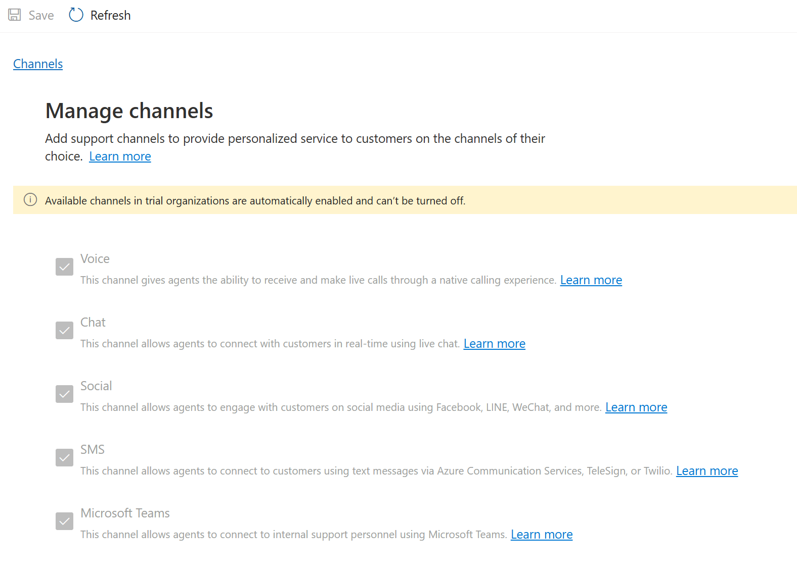
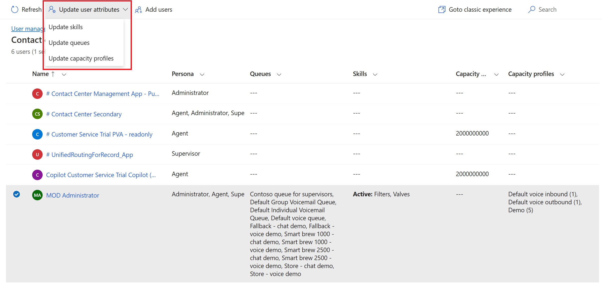

# Setting up your environment

Objective

## Task 1 - Enabling Customer Service Trial License 

1.  Enter the user id and click on **Start your free trial**

2.  Enter your contact number and **submit**

3.  You will be navigated to Customer Service workspace

4.  If you are prompted with a pop-up for using a microphone, click on
    **Allow while visiting the site**. If you are not prompted, you can
    proceed to the next step

5.  Now you are on the **Customer Service Workspace** home page.

## Task 2 - Set up channels

You can set up channels in the Customer Service admin center
application. In the Power Platform admin center, while you can view
existing environments and channels, you can't enable, edit, or delete
channels.

To set up the channels, perform the following steps:

1.  Click on **Customer Service workspace** to display the list of apps

2.  Select **Customer Service admin center** from the list of apps

3.  Select **Channels** under **Customer Support** on the left
    navigation pane.

4.  Select **Manage** for **Manage channels**. The Manage channels page
    appears.

5.  You can view the channels that are enabled.

## Task 3 – Manage Dynamics 365 Contact Center Users

1.  Select **User management** under **Customer support** in the site
    map.

2.  On the page that appears, select **Manage** for **Enhanced user
    management**. The **Contact center users** view displays the users
    that have been configured in Power Platform admin center.

3.  Hover the pointer over the rows of your admin users that you want to
    update and select the check boxes.

4.  To update user attributes, select **Update user attributes**, and
    you will see three options available. You can select one of the
    option based on your requirements

5.  **Update skills**: On the dialog box that appears, do the following:

    1.  **Add skills to users:** In the **Skills** box, select the
        skills that you want to add, select a proficiency, and then
        select **Add to all**. The selected skill and proficiency is
        added for the users in the list. To have a different proficiency
        for the skills, select one skill and proficiency at a time.

    2.  **Activate or deactivate**: Select a skill in
        the **Skills** box, and select the ellipses to select **Activate
        for all** or **Deactivate for all**. Users with a deactivated
        skill will not be considered during assignment if the skill
        requirement of a work item matches the deactivated skill.

    3.  **Remove skills**: To remove a skill from the list of users,
        select the skill in the **Skills** box, and select **Remove from
        all**. Save your changes. The selected skills are removed for
        the users.

6.  Click on **Close**

7.  Now select **your** **admin \> Update user attributes \> Update
    queues**

8.  **Update queues**: On the dialog box that appears, in
    the **Queues** box, select the queues to add or remove, and then
    select **Add to all** or **Remove from all**. Save your changes.

9.  Click on **Close**

10. Now perform step 7 again and select **Update capacity profile**

11. On this dialog box , in the **Capacity profiles** box, select the
    profiles that you want to add or remove, and then select **Add to
    all** or **Remove from all**. Save your changes.

12. Click on **Close.**
