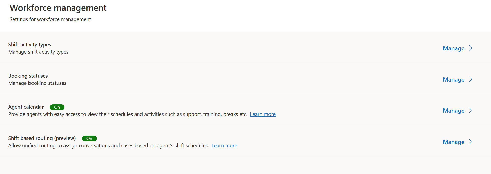
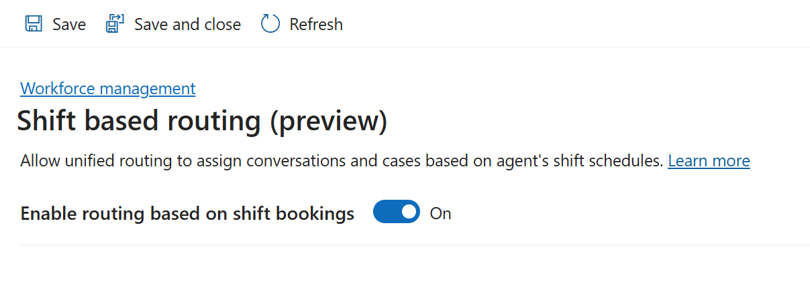

# Configure routing based on external schedules

## Prerequisites

- [Workforce Management for Customer
  Service](https://learn.microsoft.com/en-us/dynamics365/customer-service/administer/configure-agent-calendar#enable-workforce-management) is
  enabled in your environment.

- [Unified
  routing](https://learn.microsoft.com/en-us/dynamics365/customer-service/administer/provision-unified-routing) is
  provisioned and set up.

- [Workstreams](https://learn.microsoft.com/en-us/dynamics365/customer-service/administer/create-workstreams) and [advanced
  queues](https://learn.microsoft.com/en-us/dynamics365/customer-service/administer/queues-omnichannel) are
  set up.

- [Custom assignment
  method](https://learn.microsoft.com/en-us/dynamics365/customer-service/administer/configure-assignment-rules) is
  configured for the queue.

- You must have a third-party adapter configured to import agent
  schedules from an external system. Without an adapter in place,
  external schedules can't be surfaced in the agent calendar, and agents
  can't view their schedules in Dynamics 365 Customer Service.

- Shift-based routing is enabled.

- When you are importing external schedules using the third-party
  adapter, opt in every agent
  ([bookableresource](https://learn.microsoft.com/en-us/dynamics365/customer-service/develop/reference/entities/bookableresource))
  into shift-based routing by setting
  the **msdyn_generatecalendarfromshift** column of the corresponding
  bookableresource entry to **True**.

## Enable workforce management

To enable Workforce Management, complete the following steps:

1.  Navigate to your environment in [Power Platform admin
    center](https://admin.powerplatform.microsoft.com/) with the
    credentials shared to execute the labs

2.  On the command bar, select **Resources** \> **Dynamics 365 apps**.
    The Dynamics 365 apps page is displayed.

> 

3.  Search for **Workforce Management for Customer Service**, and then
    select **Install** from the list of apps.

4.  Select the environment. You must agree to the terms of service, and
    then select **Install**.

5.  Wait until the **Workforce Management for Customer Service** shows
    as installed on the **Dynamics 365 apps** page.

**Note** – The installation approximately takes 10 minutes to complete

> 

## Enable shift-based routing

1.  In the Customer Service admin center site map, select **Workforce
    management** under **Operations**.

> 

2.  In the **Shift based routing (preview)** section, select **Manage**.

3.  On the **Shift based routing (preview)** page, turn on the **Enable
    routing based on shift bookings** toggle, and then select **Save**.

