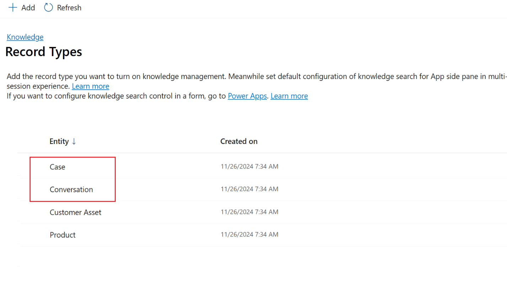
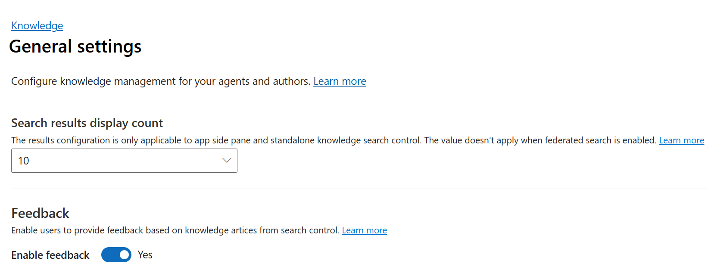
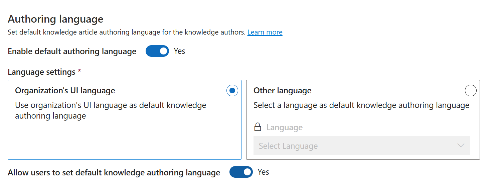

# Set up Knowledge Management

1.  In the site map of Customer Service admin center,
    select **Knowledge** in **Agent experience**. The **Knowledge** page
    appears.

## Task 1 - Record Types section

1.  In the **Record types** section, select **Manage**.

2.  On the **Record Types** page, we can add and configure the record
    types for which you want to turn on knowledge management.

3.  By default, knowledge management is enabled
    for **Case** and **Conversation** record types.

4.  On the **Record Types** page, select **Add**.

5.  The **Add record type** dialog appears. On the **Add record
    type** dialog, from the **Select record type** dropdown list, select
    the record type – **Account**

6.  Select **Save and Close**.

## Task 2 - General Settings

1.  Select Knowledge again on the left navigation pane.

2.  In the **General Settings** section, select **Manage**.
    The **General Settings** page appears.

3.  In the **Search results display count** section,

    - Select the display count from the dropdown. – 10

    - In the **Feedback** section, set the **Enable feedback** toggle
      to **Yes**.

4.  In the **Authoring language** section

    - Set the **Enable default authoring language** for your users
      to **Yes**.

    - Select the **Organization's UI language** option.

    - Set the **Allow users to set default knowledge authoring
      language** toggle to **Yes**.

1.  In the **Knowledge search experience** section, enable the following
    as required

    - **Enable suggest-as-you-type**

    &nbsp;

    - **Set search mode as all**

    &nbsp;

    - **Show recently accessed knowledge articles for cases**

7.  In the **Global search knowledge configuration** section, switch
    the **Enable Kb preview mode from global search option** toggle
    to **Yes**.

8.  Scroll up towards the top of the page and select **Save**

## Task 3 - Creating Categories 

Go back and select K**nowledge**. In the **Categories** section,
select **Manage**. The **Categories System Views** page appears. You can
create and manage a logical structure of categories for your records.

1.  On the command bar, select **New** to create a new category record.

2.  Enter the required information in the **General** section:

    - **Title**: Contoso Demo Category

    &nbsp;

    - **Description**: Contoso Demo Category

    &nbsp;

    - **Display Order**: 1

    - Select **Save & Close**

## Task 4 - Filters Section

Go back and select **Knowledge**. In the **Filters** section,
select **Manage**.

1.  Set the **Enable search filters** toggle to **Yes**.

2.  Set the **Allow agent to personalize** toggle to **Yes**. This
    allows the service representatives to save the search filters
    relevant to their areas

3.  Select **Save**

## Task 5 - Portal Section

Go back and select **Knowledge**. In the **Portal** section,
select **Manage**. The **Portals** page appears.

1.  In the **Support portal connection** section, Let us understand the
    options available.

    - Set the **Use an external portal** toggle to **Yes** to integrate
      an external portal to publish knowledge articles. For this lab,
      toggle to **No**

    &nbsp;

    - **URL Format**: Type the portal URL to use to create external
      (public-facing) portal links for knowledge articles, which the
      service representatives can share with the customers. The external
      URL is created in the following format: https://support portal
      URL/kb/{kbnum}. The placeholder, "{kbnum}", is replaced by an
      actual knowledge article number.

    - In the **Sync knowledge article attachments to portal** section,
      set the **Sync attachments to the portal** toggle to **Yes**.

    - Select **Save**

